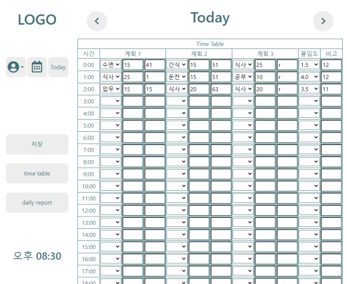

# 항해99 Daily Report 프로젝트
#### 팀원 : 김도형, 권규원, 마서현, 방민수, 이동민
#### 작업공간 : [노션](https://www.notion.so/12-c7b8bb83f4a74fa1bb96c4eb45b9fe3f), 게더타운, 카톡
<br>

## 결과
* <details>
  <summary>
  펼쳐보기
  </summary>
    <br>

        
    today time table   
    <br>    

       
    그래프 기능   
    <br>

       
    로그인 기능   
    <br>

       
    데이터 저장 기능   
    <br>

       
    mongoDB 저장 형식   
  </details>
  <br>


* ## Project
    * <details>
        <summary>아이디어</summary>
        <br>
        
        Daily report 라는 아이디어를 결정하기 전에    
        팀원들과의 지속적인 소통을 많은 아이디어가 제시되었습니다.   
        <br>
        타투이스트와 고객을 연결하는 플랫폼 / 취업 사이트 종합 플랫폼 / daily report   
        팀원분들의 과반수가 daily report 를 결정하였습니다.   
        팀원들과 소통하면서 나온 공통적인 의견 또한 있었습니다.   
        <br>
        "아이디어가 좋은 것으로 결정하기보다 배운 것을 활용할 수 있는 프로젝트가 좋다."
        </details>
        <br>
          
    * <details>
        <summary>목적</summary>
  
        항해 99 사전과제에서 배운 내용들을 활용하며 실력을 쌓는 것을 목표로 하였습니다.   
        <br>
        사전과제에서 배운 스택   
        frontend : jQuery, ajax, html, css, bootstrap   
        backend : python, flask, mongoDB   
        위 기술을 적극 활용하며 프로젝트를 만들고자 하였습니다.   
        <br>
        또한 구현을 위해 필요한 추가적인 플러그인도 활용하는 연습을 목표로 하였습니다.   
        <br>
        추가한 플러그인   
        chart.js, [datepicker (jquery)](https://api.jqueryui.com/datepicker/)
        </details>
        <br>
        
    * <details>
        <summary>사용 기술</summary>
        <br>

        frontend : jQuery, ajax, html, css, bootstrap   
        backend : python, flask, mongoDB   
        plugin : chart.js, datepicker (jquery)
        <br>
      </details>

        
<br>

* ## Frontend
    * <details>
        <summary>디자인</summary>
        <br>
        
        전체적인 디자인이 나오기까지 팀원분들의 의견과 디자인을 종합하며 발전시켰습니다.   
        frontend 의 디자인과 동시에 project 의 기능을 같이 논하였습니다.   
        <br>
        민수님의 아이디어가 채택되었기에 민수님께서 공유해주신 [link](https://www.youtube.com/watch?v=pkT1-BUP_lo) 를   
        통해 기능을 조금 더 구체적으로 생각하여 기능에 따른 front를 구성할 수 있었습니다.
      
        또한 [figma url](https://www.figma.com/file/0OkQ7yIRvUomWq7zRJrGh5/Untitled?node-id=0%3A1) 를 활용하여
        frontend 의 픽셀이나 비율을 조금 더 자세하게 공유하였습니다.   
        <br>
           
        초안 1   
        <br>
           
        초안 1-2   
        <br>
            
        초안 2   
        <br>
           
        초안 1 발전   
        
        </details>
        <br>
        
    * <details>
        <summary>그리드</summary>
        <br>

        그리드를 만드는데 2가지 방법을 사용하였습니다.   
        <br>
        그리드를 활용한 방법   
        ```
        display:grid; 
        grid-template-columns: 1fr 1fr; 
        grid-template-rows: 1fr 1fr 1fr;
        grid-template-areas:
        "item1 item2"
        "item3 item4"
        "item5 item6";
        ```
        
        테이블을 활용한 방법   
        ```
        <table>
            <tr>
                <td colspan="" gridspan=""></td>
            </tr>
        </table>
        ```
        
        디자인의 전체적인 윤곽을 잡는데에는 그리드를 활용하였습니다.    
        <br>
      
        그리드를 활용하여 작성한 내용   
        
        <br>
      
        테이블을 활용하여 작성한 내용   
        
        
        그리드와 테이블의 차이점이라고 한다면   
        그리드의 경우 column과 row로 한칸마다 size를 구분할 수 있습니다.   
        ```
        grid-template-columns: 1fr 1fr; 
        grid-template-rows: 1fr 1fr 1fr;
        ```
        그리드는 테이블보다 조금 더 정확한 레이아웃을 구성하는데 좋습니다.   
        <br>
        반면 테이블의 경우 colspan과 rowspan을 통하여 td가 차지하는 정도를 구분지을 수 있습니다.   
        CSS 에 지정된 그대로 grid/table 은 그 용어에 맞게 사용하는 것이 좋다고 생각하였습니다.     
        </details>
        <br>

    * <details>
        <summary>기능구현</summary>
        <br>

        ## 대부분의 기능들은 ajax
        기능의 경우 대부분 백엔드의 api들을 ajax를 통하여 받아 front에 표기하는 형식이였습니다.
        ```javascript
        $.ajax({
        type: "POST",
        url: "/getdaily",
        data: {
        id: id,
        date: date,
        }, ...
        ``` 
      
        그 이후 이어지는 json을 풀어주는 코드   
        ```javascript
        success: function (response) {
                if (response['res'] === true) {
                    console.log(response['msg']);
                    console.log(response['val']);
                    did = response['val']['did'];
                    for (let i = 0; i < did.length; i++) {
                        time_name = did[i]['time_name'];
                        time_comment = did[i]['time_comment'];
                        time_score = did[i]['time_score'];
                        for (let z = 1; z <= 3; z++) {
                            if (!(did[i]['time_did'][z - 1]['do'])) {
                                break;
                            }
                            $(`.time_${time_name} .time_do_${z}`).val(did[i]['time_did'][z - 1]['do']);
                            $(`.time_${time_name} .time_long_${z}`).val(did[i]['time_did'][z - 1]['long']);
                            $(`.time_${time_name} .time_desc_${z}`).val(did[i]['time_did'][z - 1]['desc']);
                        }
                        $(`.time_${time_name} .time_score`).val(time_score);
                        $(`.time_${time_name} .time_comment`).val(time_comment);
                    }
                }
        ```
        <br>

        ## 쿠키를 구현하여 로그인을 유지하는 코드의 경우   
        ```javascript
        function login() {
            let login_id = $("#login-id").val();
            let login_password = $("#login-password").val();
            $.ajax({
                type: "POST",
                url: "/login",
                data: {
                    id: login_id,
                    pw: login_password,
                },
                success: function (response) {
                    if (response['res'] === true) {
                        //  로그인 성공
                        setCookie('user_id', response['id'], 30)
                        setCookie('login_checker', true, 30)
        ```
        로그인이 성공되면 setCookie로 해당 parameter 들을 보냅니다.   
        <br>

        저장된 쿠키는 사이트가 로딩되는 대로 getCookie 함수로 받아들입니다.   
        ```javascript
        // 사이트 로딩끝나면 즉시 작동되는 함수들
        $("document").ready(function () {
            login_checker = getCookie('login_checker');
            user_id = getCookie('user_id');
            ...
        ```
        <br>


        저장과 불러오기에 사용되는 getCookie(), setCookie()   
        ```javascript
        function getCookie(name) {
            let value = document.cookie.match('(^|;) ?' + name + '=([^;]*)(;|$)');
            return value ? value[2] : null;
        }
        ```

        exp를 통하여 쿠키가 유효한 기간을 정합니다.   
        ```javascript
        function setCookie(name, value, exp) {
            let date = new Date();
            date.setTime(date.getTime() + exp * 60 * 1000);
            document.cookie = name + '=' + value + ';expires=' + date.toUTCString() + ';path=/';
        }
        ```
        <br>
        <br>
      
        ## 그외
        추가적으로 많은 기능들도 필요에 따라 작성하게 되었습니다.   
        
        ```javascript
        // timetable 만드는 function
        function loadTimeTable()
      
        // timetable/daily report 보이는 것을 변환
        function changeToReportTable()
      
        // timetable/daily report 보이는 것을 변환
        function changeToTimeTable()
      
        // 로드된 이후 datepicker plugin에 오늘을 지정
        function setTodayAfterLoad()
      
        // 시계 기능
        function getTime()
      
        // 날짜 타이틀 바뀌는 함수
        function changeCurrentDate()
      
        // account.js
        function clean_forms()
        function show_dropdown()
        function showSignUpArea()
        function login()
        function login_success(id)
        function submitSignupForm()
      
        // timetable 관련 함수
        function save_timetable()
        function get_timetable()
        // chart 관련 함수
        ...지금도 작성중...
        ``` 
    
        </details>
        <br>

<br>

* ## Backend
    * <details>
        <summary>디자인</summary>
        <br>
        
        API나 기능을 먼저 생각해보자는 의견도 있었지만   
        팀원분들과 의견을 나눈 결과   
        frontend 디자인 -> 기능 -> api 순서로 구성을 짜는 것이 좋다고 결론지었습니다.   
        <br>
        그 이후 카톡이나 디스코드, 게더타운으로 모이면서 api에 대한 대략적인 구성에 대한 의견을 나눴습니다.   
        
        /path, parameters -> 기능   
        
        <br>
      
        물론 짠 api대로 모든 것이 정확히 되지는 않았지만 방향성을 잡는데 도움이 되었습니다.   
        </details>
        <br>
          
    * <details>
        <summary>API</summary>
        <br>
      
        모든 api는   
        `{ res : True/False, msg : "백엔드 메시지", val : 요청한 데이터 }`   
        의 기본적인 형태를 따릅니다.
      
        res : backend에서 해당 요청을 성공하였는지 실패하였는지   
        msg : frontend에서 alarm을 통하여 사용자에게 표기할 메시지   
        val : 요청한 결과 json   
        
        또한 받는 parameter는 통일성을 위해 url?param을 사용하지 않고   
        post의 body로 통합하기로 하였습니다.   
      
        api 구성
        ```python
        # GET -> 메인 페이지
        @app.route('/', methods=['GET'])
        def main():
      
        # POST(id,pw) -> 로그인
        @app.route('/login', methods=['POST'])
        def login():
      
        # POST(id,pw) -> 회원가입
        @app.route('/signup', methods=['POST'])
        def signup():
      
        # POST(id, date, did(JSON)) -> daily table 저장
        @app.route('/postdaily', methods=['POST'])
        def post_daily():
      
        # POST (id, date) -> daily table 받기
        @app.route('/getdaily', methods=['POST'])
        def get_daily():  
      
        # POST (id, date) -> 라인그래프에 쓸 시간별 몰입도 데이터 받기
        @app.route('/graph', methods=['POST'])
        def graph():
      
        # POST (id, date) -> dailyreport 와 piechart에 모두 쓸 데이터 받기
        @app.route('/piechart', methods=['POST'])
        def piechart():
      
        # POST (id, date) -> date의 평균 몰입도 받기
        @app.route('/avgimmerse', methods=['POST'])
        def avgimmerse():
        ```
        </details>
        <br>
      
    * <details>
        <summary>DATABASE</summary>
        <br>

        mongoDB는 일반 SQL DB와 다릅니다.   
        일반적인 SQL과 같은 경우에는 array를 저장할 수 없습니다.   
        SQL에 array를 저장하고 싶을 경우 one-to-many의 table 관계를 만들어야 합니다.   

        반면 mongoDB의 경우 array를 바로 저장할 수 있습니다.    
           
        <br>

        시작하면서 이 기능을 적극적으로 활용하지 못했습니다.   
        처음에는 one-to-many의 저장 형태도 구성하지 않았었습니다.   
           
        <br>

        category1, category2, category3 를 하나의 table에 저장하였지만   
        mongoDB에 array의 형태로 저장이 가능하다는 정보를 공유한      
        규원님 덕분에 더욱 간략하게 만들 수 있었습니다.   

        <br>

        * <details>
          <summary>array를 사용하지 않고 무식하게 저장한 방법 (75줄)</summary>
            <br>
    
            ```python
            # POST(id, year, month, date, plan1/2/3_category, plan1/2/3_hour, plan1/2/3_description, immerse, about) -> 하루 저장
            @app.route('/postdaily', methods=['POST'])
            def post_daily():
            # id,year,month,date 를 POST 의 body 에서 받습니다.
            id = request.form['id']
            year = request.form['year']
            month = request.form['month']
            date = request.form['date']

            # plan1,2,3의 category, hour, description 를 POST 의 body 에서 받습니다.
            plan1_category = request.form['plan1_category']
            plan1_hour = request.form['plan1_hour']
            plan1_description = request.form['plan1_description']

            plan2_category = request.form['plan2_category']
            plan2_hour = request.form['plan2_hour']
            plan2_description = request.form['plan2_description']

            plan3_category = request.form['plan3_category']
            plan3_hour = request.form['plan3_hour']
            plan3_description = request.form['plan3_description']

            # immerse(몰입도), about(비고)를 POST 의 body 에서 받습니다.
            immerse = request.form['immerse']
            about = request.form['about']

            # 해당 id,year,month,date 가 일치하는 데이터가 있는지 확인합니다.
            daily_data = db.timeTable.find_one({'id': id, 'year': year, 'month': month, 'date': date}, {'_id': False})

            # 저장된 적이 없었다면
            if daily_data is None:
                # 표에서 받은 모든 데이터를 저장합니다.
                db.timeTable.insert_one({
                    'id': id,
                    'year': year,
                    'month': month,
                    'date': date,
                    'plan1_category': plan1_category,
                    'plan1_hour': plan1_hour,
                    'plan1_description': plan1_description,
                    'plan2_category': plan2_category,
                    'plan2_hour': plan2_hour,
                    'plan2_description': plan2_description,
                    'plan3_category': plan3_category,
                    'plan3_hour': plan3_hour,
                    'plan3_description': plan3_description,
                    'immerse': immerse,
                    'about': about
                })
                return "해당 날짜의 데이터가 저장되었습니다"
            else:
                # 표에서 받은 모든 데이터를 업데이트 합니다.
                db.timeTable.update_one({
                    # id,year,month,date 가 일치하는 곳에서
                    'id': id,
                    'year': year,
                    'month': month,
                    'date': date
                    # 받은 자료들을 업데이트 합니다.
                }, {'$set': {
                    'plan1_category': plan1_category,
                    'plan1_hour': plan1_hour,
                    'plan1_description': plan1_description,
                    'plan2_category': plan2_category,
                    'plan2_hour': plan2_hour,
                    'plan2_description': plan2_description,
                    'plan3_category': plan3_category,
                    'plan3_hour': plan3_hour,
                    'plan3_description': plan3_description,
                    'immerse': immerse,
                    'about': about
                }})
                return "해당 날짜의 데이터가 업데이트되었습니다"
            ```
            </details>
    
        * <details>
          <summary>array를 사용한 elegant한 방법 (19줄)</summary>
            <br>

            ```python
            # POST(id, date, did(JSON)) -> daily table 저장
            @app.route('/postdaily', methods=['POST'])
            def post_daily():
                # id,year,month,date 를 POST 의 body 에서 받습니다.
                id = request.form['id']
                date = request.form['date']  # ex) 2021-06-02
                did = json.loads(
                    request.form['did'])  # [{time_name: 0,time_did: [do:'',long:'',desk:''],time_score: '',time_comment: ''},]

                time_data = db.timeTable.find_one({'id': id, 'date': date}, {'_id': False})
                # 저장된 적이 없었다면
                if time_data is None:
                    db.timeTable.insert_one({'id': id, 'date': date, 'did': did})
                    return {'res': True, 'msg': "해당 날짜의 데이터가 저장되었습니다"}
                # 저장된 적이 있다면
                else:
                    db.timeTable.update_one({'id': id, 'date': date}, {
                                            '$set': {'did': did}})
                    return {'res': True, 'msg': "해당 날짜의 데이터가 업데이트 되었습니다"}
            ```
            </details>

        <br>

        </details>
        <br>

    * <details>
        <summary>기능구현</summary>
        <br>
        
        백엔드의 기능은 pymongoDB로 받은 데이터베이스의 dict와 array를   
        frontend에서 표기하고 싶은데로 변형하고 return하는 것이였습니다.   
        <br>

        일반적으로 request.form (json body) 의 형태로 데이터를 받거나   
        ```python
        request.form['id']
        ```   
        <br>

        request.form의 특정 parameter는 json으로 받기도 하였습니다.   
        받는 형식이 복잡한 경우 array로 받고 사용하기에 편리합니다.   
        ```python
        did = json.loads(request.form['did']) 
        ```
        <br>

        이렇게 request에서 받은 데이터를 사용하여 mongoDB에서 데이터를 받아   
        필요한 형태로 변형합니다.   
        <br>

        ex) def graph()의 한 부분 (형태변환)
        ```python
        # 0 ~ 23 까지의 각 시간값과 0 이 들어있는 리스트를 만듭니다.
        # list_no_saved = [ [0, 0], [1, 0], ..., [22, 0], [23, 0] ]
        list_no_saved = []
        for i in range(24):
            list_no_saved.append(i)
            list_no_saved[i] = [i, 0]
        ...
        ```

        그 이후 정해진 형식에 맞게 return 하면 대부분의 기능들은 구현할 수 있습니다.   
        ```python
        return jsonify({'res': True, 'msg': "평균 몰입도를 받았습니다", 'val': val})
        ```

        </details>
        <br>
